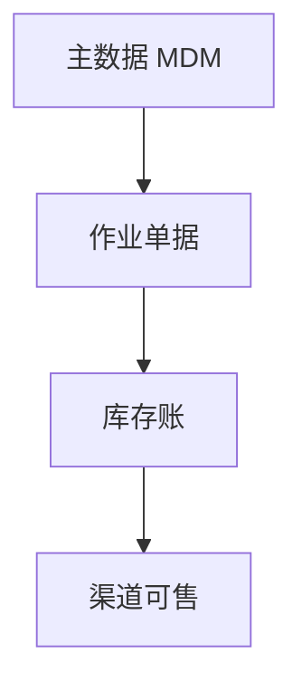

# 架构师 10 Step 工作流

> 每次只执行 **一个 Step**。Step 末：`Step N 完成，请确认后继续 Step N+1。`  
> **不写实现代码**；DDL/API 落地见 Handoff。

---

## 入口分流（必须先做）

```text
用户诉求？
  ├─ 全新业务域 0→1        → Step 1 起（完整 10 步）
  ├─ 已有域 PRD（波次 PRODUCT）→ 先读 reference.md 资产表，只跑增量 Step
  ├─ 仅流程/状态机          → Step 4 → 5 →（可选 9）
  ├─ 仅异常/容灾            → Step 9（需 Step 4–5 上下文则先补）
  └─ 仅 PRD 成稿            → Step 1–9 已有草稿 → Step 10 汇总
```

Agent 开场输出：

```markdown
# 架构分流

- **范围**：（全新 / 增量 / 单 Step 段）
- **建议起点**：Step N
- **将阅读的已有文档**：（列路径）
- **预计产出**：（本 Step 交付物）

确认后只执行 Step N。
```

---

## Step 1 — 业务分析

**必读**：[ROADMAP.md](../../docs/ROADMAP.md) · 已有 PRD（若有）

**产出**

- 业务背景、角色（运营/仓/财务/门店/供应商）
- 痛点与 KPI（履约、周转、超卖、账实一致）
- **MVP 范围** vs 远期（显式写出「本期不做」）
- 风险初表（1～3 条）

**输出标题**：`# Step 1 — 业务分析`

---

## Step 2 — 领域模型 · DDD 划分

**必读**：[ARCHITECTURE.md](../../docs/ARCHITECTURE.md) · [MODULE_RULES.md](../../docs/MODULE_RULES.md)

**产出**

- Bounded Context 列表（`wms` / `oms` / `inventory` / `prd`…）
- 上下文映射图（上下游关系）
- 聚合根草案（主数据 / 单据 / 库存账）
- **跨域规则**：仅 Facade + Event，无跨域 Mapper



**输出标题**：`# Step 2 — 领域模型`

---

## Step 3 — 主数据设计

**必读**：[B1-org/PRODUCT.md](../../docs/domains/wms/prd/B1-org/PRODUCT.md) · [industry-baseline.md](../scm-product-manager/industry-baseline.md) §2

**产出**（按需选取，非全部重做）

| 实体 | 关键属性 | 归属域 | 表前缀 |
| --- | --- | --- | --- |
| 组织 | 组织类型、层级 | WMS | `wms_org` |
| 仓库 | category/subtype | WMS | `wms_warehouse` |
| 商品 | SKU、类目、条码 | Product | `prd_*` · [B2 PRODUCT.md](../../docs/domains/product/prd/B2-product/PRODUCT.md) Step 2 已定稿 |
| 供应商 | — | OMS/主数据 | `oms_*` |
| 客户 | — | 平台/CRM 远期 | — |

- 主数据 vs 单据边界
- 租户 `tenant_id` 范围说明

**输出标题**：`# Step 3 — 主数据设计`

---

## Step 4 — 业务流程设计

**必读**：[industry-baseline.md](../scm-product-manager/industry-baseline.md) §3 · [B2-product/PRODUCT.md](../../docs/domains/product/prd/B2-product/PRODUCT.md)

**产出**（每条流程：触发 → 步骤 → 产出单据/库存变化）

- 订单流程
- 库存流程（预占/扣减/释放）
- 采购流程
- 仓储流程（入/出/移/盘）
- 售后流程

标注 `[业务]` / `[产品]` / `[研发]` 读者。流程范围对齐当期 PRD 与 [industry-baseline.md](../scm-product-manager/industry-baseline.md) §3 波次（勿默认全链路）：

```text
B1 组织 → B2 商品 → B3 仓 → B4 库存 → B5 入出 → B6 订单 → B7 盘点/调拨
```

**输出标题**：`# Step 4 — 业务流程设计`

---

## Step 5 — 状态机设计

**必读**：[CODE_CONVENTION.md](../../docs/CODE_CONVENTION.md)（单据码待 B5+ PRD 定稿）

**产出**

- 订单 / 库存 / 物流 / 售后 状态表（**SMALLINT 步长 10**）
- 状态转移表（from → event → to → 副作用）
- 区分：**单据 status** vs **盘点差异** vs **库存数量**

**输出标题**：`# Step 5 — 状态机设计`

---

## Step 6 — 数据库设计

**必读**：[DATABASE.md](../../docs/DATABASE.md)

**产出**

- ER 图（mermaid `erDiagram` 或文字说明）
- 表清单：前缀、`tenant_id`、审计、`del_flag`
- 索引与唯一键（含 `tenant_id`）
- 容量量级简表（10万/百万行场景）
- 单据表 `idempotency_key`（若适用）

**Handoff**：定稿后 → `@mysql-dba` Step 3 起写 DDL

**输出标题**：`# Step 6 — 数据库设计`

---

## Step 7 — 接口设计

**必读**：[API_CONTRACT.md](../../docs/API_CONTRACT.md)

**产出**

- Facade 方法清单（Command/Query/Dto）
- Admin HTTP 路径草案（`/api/scm/{domain}/...`）
- 跨域 **Event** 清单（发布方/订阅方）
- 幂等、错误码域
- MQ：默认 **进程内 Event**；独立 MQ 须 Step 1 明确

**Handoff**：定稿后 → `@java-backend-dev` + 更新 `API_CONTRACT.md`

**输出标题**：`# Step 7 — 接口设计`

---

## Step 8 — 系统架构

**必读**：[ARCHITECTURE.md](../../docs/ARCHITECTURE.md) · [DISTRIBUTED_EVOLUTION.md](../../docs/DISTRIBUTED_EVOLUTION.md)

**产出**

- 当前态：**模块化单体** + 单库（默认）
- 模块图：OMS / WMS / SCM / Inventory / 平台
- 网关、缓存、搜索、MQ：**仅列本期需要**；远期单独标注
- ERP/CRM：集成边界（不默认自建全套 ERP）

**输出标题**：`# Step 8 — 系统架构`

---

## Step 9 — 异常场景设计

**必读**：当期波次 [PRODUCT.md](../../docs/domains/README.md) 异常/AC 相关节

**产出**（场景 → 检测 → 处理 → 恢复 → 审计）

| 场景 | 必答 |
| --- | --- |
| 超卖 / 超卖回滚 | 预占、ATP、释放 |
| 支付超时 | 订单关单、释预占 |
| 发货失败 | 出库任务回退 |
| 库存不一致 | 盘点、调整单、流水 |
| 供应商缺货 | 采购/订单联动 |
| 退货 / 换货 / 拒收 | 逆向单、RETURN 池（非 VIRTUAL 共享池） |

**输出标题**：`# Step 9 — 异常场景设计`

---

## Step 10 — PRD 输出

**必读**：对标 [B1-org/PRODUCT.md](../../docs/domains/wms/prd/B1-org/PRODUCT.md) 结构

**产出** — 完整 PRD 须含：

1. 版本与修订表
2. 三类读者约定（`[业务]`/`[产品]`/`[研发]`）
3. 设计总纲 + 能力边界（MVP vs 远期）
4. FR 功能需求列表
5. AC 验收标准（可测）
6. FR↔AC 追溯矩阵
7. 关联 SQL / 码表文档链接

**建议路径**：`docs/domains/{域}/design/B{n}-{slug}/TECH.md`（产品章在同级 `prd/`）

**Handoff**：PRD 定稿 → `@scm-platform-dev` 排实现顺序

**输出标题**：`# Step 10 — PRD 输出`

---

## 设计 → 实现总 Handoff

```text
Step 6  → mysql-dba → scm-crud-generate（主数据）/ java-backend-dev（单据）
Step 7  → java-backend-dev + API_CONTRACT.md
Step 10 → docs/*.md → scm-platform-dev
```

设计评审（可选）：`@code-review-scm` 对 PRD/DDL 草案做 §A/C 对照。
